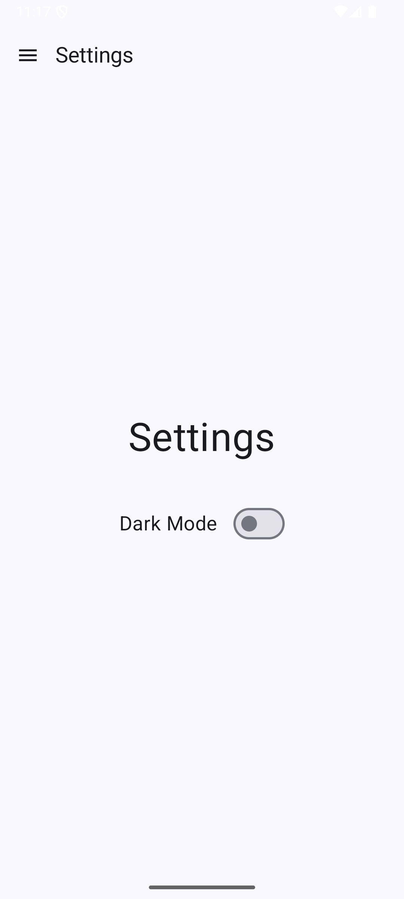

# Phelela-Mind

**Phelela-Mind** is a minimalist Android app that helps you stay organized and focused. It combines a fast to-do list, a calendar view, and simple budgeting tools — all in one place. Whether you're managing daily tasks, tracking events, or monitoring your personal finances, Phelela-Mind helps you stay on track with ease.

---

## Features

- **Navigation Drawer** for easy access to all sections of the app

  
  

- **Home Screen**: Daily overview of all tasks scheduled for the current day

  
  

- **Task Management**:
    - Create, edit, and delete tasks
    - Assign tasks to specific dates

  
  

- **Calendar View**:
    - Visual calendar interface
    - Tap any date to view tasks for that day

  
  
  
  

- **Budget Tracker**:
    - Create custom budgets for various needs
    - Add expenses and monitor remaining budget in real time

  
  
  
  

- **Settings**:
    - Toggle between light and dark mode

  
  

---

## Built With

Phelela-Mind uses modern Android development tools and libraries, including:

- **Kotlin 2.0**
- **Jetpack Compose**
- **Room** for local database storage
- **Koin** for dependency injection
- **Material 3 UI Components**
- **Android Navigation Component**
- **Generative AI client (Google)** (for future expansion or functionality)
- **Dark Mode Support**

---
